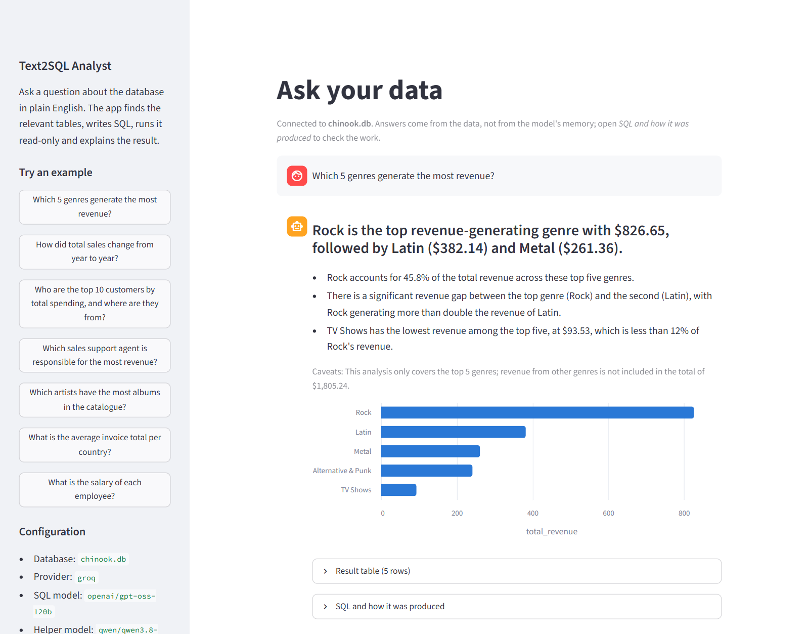
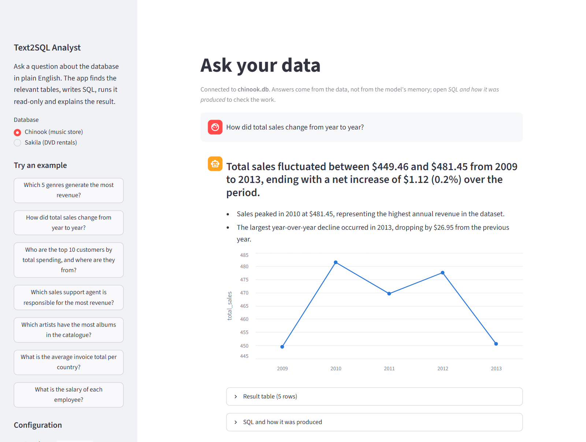
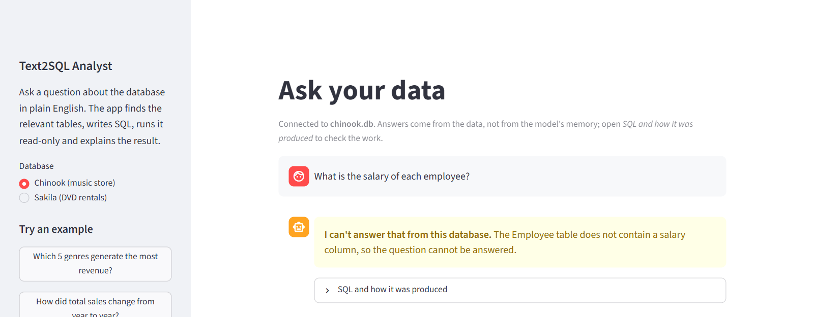
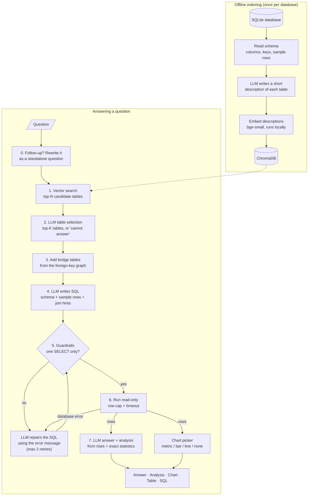
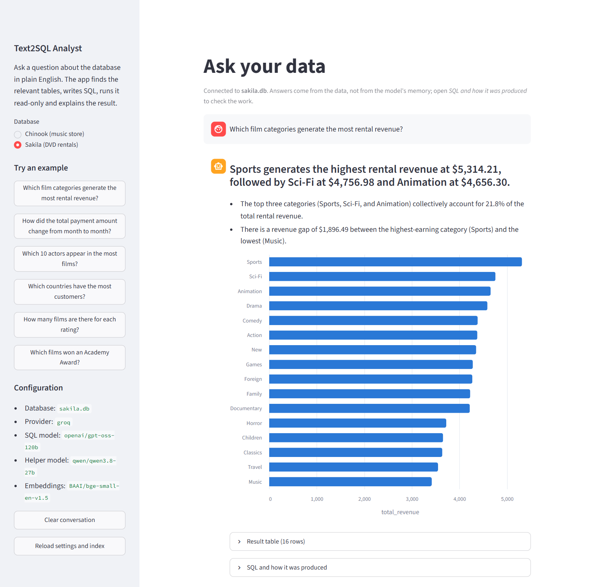

# Text2SQL Analyst

[](https://github.com/VinayakMokashi/text2sql-analyst/actions/workflows/ci.yml)

[](LICENSE)

**Ask a database questions in plain English and get answers, not just queries.**

Text2SQL Analyst finds the tables relevant to your question, writes SQL, runs it
safely (read-only), and replies with a short answer, a brief analysis and a chart when
one helps. The generated SQL is always available one click away, so you can check the
work.

It is a small, readable implementation of a retrieval-augmented Text-to-SQL pipeline,
built entirely on free and open-source pieces: open-weight LLMs (served for free by
Groq, or locally with Ollama), a local embedding model, ChromaDB and SQLite.



### Example

**Question:** *Which 5 genres generate the most revenue?*

> **Rock is the top revenue-generating genre with $826.65, followed by Latin ($382.14)
> and Metal ($261.36).**
>
> - Rock accounts for 45.8% of the total revenue across these top five genres.
> - There is a significant revenue gap between the top genre (Rock) and the second
>   (Latin), with Rock generating more than double the revenue of Latin.
> - TV Shows has the lowest revenue among the top five, at $93.53, which is less than
>   12% of Rock's revenue.
>
> *Caveats: This analysis only covers the top 5 genres; revenue from other genres is not
> included in the total of $1,805.24.*

| genre | total_revenue |
|---|---|
| Rock | 826.65 |
| Latin | 382.14 |
| Metal | 261.36 |
| Alternative & Punk | 241.56 |
| TV Shows | 93.53 |

<details>
<summary>Generated SQL (hidden by default, one click away in the app)</summary>

```sql
SELECT
    g.Name AS genre,
    ROUND(SUM(il.UnitPrice * il.Quantity), 2) AS total_revenue
FROM InvoiceLine il
JOIN Track t      ON il.TrackId = t.TrackId
JOIN Genre g      ON t.GenreId = g.GenreId
GROUP BY g.GenreId, g.Name
ORDER BY total_revenue DESC
LIMIT 5
```

Tables found by vector search: Genre, Track, InvoiceLine, Artist, Invoice, Album.
Tables kept by the LLM: Genre, Track, InvoiceLine. Total time: 1.8 s.
</details>

Trends get a line chart, and the answer states the overall change exactly:



When the data cannot answer a question, it says so instead of guessing:



---

## Contents

- [How it works](#how-it-works)
- [Setup](#setup)
- [Usage](#usage)
- [Use your own database](#use-your-own-database)
- [Deploy a free public demo](#deploy-a-free-public-demo)
- [Models and providers](#models-and-providers)
- [Evaluation](#evaluation)
- [Safety](#safety)
- [Project structure](#project-structure)
- [Limitations and future work](#limitations-and-future-work)
- [Credits and references](#credits-and-references)

---

## How it works

The design follows the three stages of the Text-to-SQL pipeline described in the
[NL2SQL Handbook](https://github.com/hkustdial/nl2sql_handbook): **pre-processing**
(schema linking), **translation** (SQL generation) and **post-processing** (correction),
plus an explanation step on top.



### Offline: building the index

1. **Read the schema** ([`db/schema.py`](src/text2sql/db/schema.py)). For every table
   we collect columns, types, primary and foreign keys, the row count and three sample
   rows.
2. **Describe each table** ([`indexing/describe.py`](src/text2sql/indexing/describe.py)).
   An LLM writes two or three sentences per table, such as "each row of `InvoiceLine` is
   one purchased track... useful for sales and revenue questions". Column names alone
   match questions poorly, and descriptions bridge that vocabulary gap. They are saved to
   `data/index/<db>/table_docs.json`, which you can read and edit by hand.
3. **Embed and store** ([`indexing/indexer.py`](src/text2sql/indexing/indexer.py)). The
   descriptions are embedded with `BAAI/bge-small-en-v1.5`, which runs locally on the CPU
   through ONNX, and stored in a persistent ChromaDB collection.

### Online: answering a question

0. **Follow-ups become standalone questions**
   ([`conversation.py`](src/text2sql/conversation.py)). In a conversation, "and in
   2012?" only makes sense next to the previous question. The helper model rewrites it,
   using the last three questions and their SQL, into "How many invoices were issued in
   2012?", and every later step works on that. The app shows the rewrite as
   *Interpreted as: ...*, so a wrong reading is easy to spot. The first question of a
   conversation skips this step.
1. **Vector search** ([`retrieval/retriever.py`](src/text2sql/retrieval/retriever.py)).
   The question is embedded and the top-N (default 6) most similar tables are
   retrieved. This step favors recall.
2. **LLM table selection** ([`retrieval/selector.py`](src/text2sql/retrieval/selector.py)).
   A fast model reads the candidates' descriptions and columns and keeps only the
   tables it needs (at most K, default 6). This step favors precision. The model also
   sees the *names* of all other tables, so it can still pick a table that vector search
   ranked just below the cut-off. It can also decide that the question **cannot be
   answered** from this data ("What is the weather tomorrow?"), and the pipeline then
   says so instead of guessing.
3. **Join-path expansion** ([`retrieval/joins.py`](src/text2sql/retrieval/joins.py)).
   "Revenue per genre" needs `Genre` and `InvoiceLine`, but they only connect through
   `Track`, which the question never mentions. A shortest-path search over the
   foreign-key graph adds such bridge tables deterministically.
4. **SQL generation** ([`generation/`](src/text2sql/generation/sql_generator.py),
   [`prompts.py`](src/text2sql/prompts.py)). The prompt contains the question, the
   selected tables as `CREATE TABLE` statements, a few sample rows (so the model sees
   value formats such as `'2010-01-15 00:00:00'`), the exact join conditions, and the
   SQL dialect. The model may also answer `CANNOT_ANSWER: <reason>`.
5. **Guardrails** ([`execution/guardrails.py`](src/text2sql/execution/guardrails.py)).
   `sqlglot` parses the query, which must be exactly one `SELECT`/`WITH` statement with
   no writes, `PRAGMA`, `ATTACH` or dangerous functions. See [Safety](#safety).
6. **Read-only execution with self-correction**
   ([`execution/executor.py`](src/text2sql/execution/executor.py),
   [`pipeline.py`](src/text2sql/pipeline.py)). The query runs on a read-only
   connection with a row cap and a timeout. If it is rejected or fails, the error
   message goes back to the model to fix its own query, up to two times.
7. **Answer and analysis** ([`analysis/answer.py`](src/text2sql/analysis/answer.py)).
   The model gets the question, the SQL, the rows, and **summary statistics computed by
   the application** (totals, averages, extremes, and the share of the top item). LLMs
   are weak at arithmetic over many rows, so the model is asked to explain these exact
   numbers rather than compute them. It returns a direct answer, up to three insights
   and any caveats.
8. **Chart** ([`analysis/charts.py`](src/text2sql/analysis/charts.py)). A conservative
   rule picks the visual. A single number becomes a metric tile. A time column plus a
   number becomes a line chart. A category column plus a number (2–25 rows) becomes a
   sorted bar chart. Anything else gets no chart, because a misleading chart is worse
   than none.

Each stage is a small module with a typed result, and the Streamlit app, the CLI and
the evaluation all call the same `Pipeline.ask()`.

---

## Setup

You need **Python 3.11+** and **git**. The steps below take about 5 minutes. The only
downloads are Python packages, the 1 MB sample database and a 65 MB embedding model;
no large LLM weights.

### 1. Clone and install

```bash
git clone https://github.com/VinayakMokashi/text2sql-analyst.git
cd text2sql-analyst

python -m venv .venv
# Windows (PowerShell):   .venv\Scripts\Activate.ps1
# macOS / Linux:          source .venv/bin/activate

pip install -e ".[dev]"        # or: pip install -r requirements.txt && pip install -e .
```

### 2. Get a free LLM API key (Groq)

1. Sign up at [console.groq.com](https://console.groq.com) (free, no credit card).
2. Create a key under **API Keys**.
3. Copy the example config and paste your key:

```bash
cp .env.example .env           # Windows: copy .env.example .env
# then edit .env and set:  GROQ_API_KEY=gsk_...
```

`.env` is in `.gitignore`, so your key is never committed. If you would rather run
everything locally, see [Run fully offline with Ollama](#run-fully-offline-with-ollama).

### 3. Download the sample database and build its index (optional for the app)

The Streamlit app does this by itself on first run, for both sample databases, using
table descriptions that ship with the app. The CLI needs it done up front:

```bash
python scripts/download_sample_db.py            # Chinook (default)
python scripts/download_sample_db.py sakila     # optional second database
python -m text2sql index                        # and --db data/sakila.db for Sakila
```

This saves [Chinook](https://github.com/lerocha/chinook-database) to
`data/chinook.db`. Chinook is a digital music store with 11 tables: artists, albums,
tracks, genres, playlists, customers, employees, invoices and invoice lines. The
optional [Sakila](https://github.com/jOOQ/sakila) database is a DVD-rental chain with
15 tables; see [Use your own database](#use-your-own-database).

`index` makes one short LLM call per table (11 calls for Chinook) to write the
descriptions, then embeds them locally. The first run also downloads the embedding
model. With `--no-llm`, tables that have no description yet get a template one, so no
API key is needed; existing descriptions are always reused unless you pass `--refresh`.

### 4. Run it

```bash
streamlit run app/streamlit_app.py      # web UI at http://localhost:8501
python -m text2sql ask "Which 5 genres generate the most revenue?"
```

A `Makefile` wraps these steps (`make install data index app test eval`). On Windows
without `make`, run the commands shown in it.

---

## Usage

### Streamlit app

```bash
streamlit run app/streamlit_app.py
```

Type a question or click an example in the sidebar. Follow-up questions work: ask "How
many invoices were issued in 2010?", then "and in 2012?", then "Which country had the
most of them?". Each answer shows:

1. **The answer** in one or two sentences, with the key numbers
2. **Analysis**: up to three observations (comparisons, concentration, trends) and caveats
3. **A chart**, when the shape of the result suits one
4. **The result table**
5. **SQL and how it was produced** (collapsed): the query, any self-correction steps,
   the candidate tables with similarity scores, the tables the LLM selected, bridge
   tables added for joins, and timings per stage

### CLI

```bash
python -m text2sql ask "Who are the top 5 customers by total spending?"
python -m text2sql ask "How did revenue change year over year?" --no-sql
python -m text2sql chat              # a conversation: follow-up questions work
python -m text2sql tables            # list tables and their generated descriptions
python -m text2sql models            # list the models your provider/key can use today
python -m text2sql index --refresh   # regenerate the table descriptions
```

Every command accepts `--db`, `--provider`, `--sql-model` and `--helper-model` to
override `.env` for a single run.

### Example questions to try

| Question | What it exercises |
|---|---|
| Which 5 genres generate the most revenue? | 3-table join through a bridge table, ranking, bar chart |
| How did total sales change from year to year? | date functions, line chart |
| Which sales support agent is responsible for the most revenue? | employee → customer → invoice joins |
| What percentage of revenue comes from the USA? | conditional aggregation, metric tile |
| How many tracks have never been purchased? | anti-join / `NOT IN` subquery |
| Which employee has the most people reporting to them? | self-join |
| What is the salary of each employee? | the data has no salaries, so it declines instead of guessing |

---

## Use your own database

Any SQLite file works:

```bash
# in .env
T2S_DB_PATH=path/to/your.db
```

```bash
python -m text2sql index        # builds data/index/<your db name>/
streamlit run app/streamlit_app.py
```

Each database gets its own index folder, so you can switch back and forth. The index
remembers which database file built it, and the app refuses to use it for a different
file with the same name. After moving a database, re-index with
`python -m text2sql index --force`. If you re-index while the Streamlit app is running,
click **Reload settings and index** in its sidebar (this also picks up a changed `.env`).

### Try it on a second database: Sakila

To check that nothing is tuned to Chinook, the project also runs on
[Sakila](https://github.com/jOOQ/sakila), a DVD-rental chain with 15 tables and a
completely different domain (films, actors, inventory, rentals, payments, stores):

```bash
python scripts/download_sample_db.py sakila
python -m text2sql index --db data/sakila.db
python -m text2sql ask --db data/sakila.db "Which film categories generate the most rental revenue?"
T2S_DB_PATH=data/sakila.db streamlit run app/streamlit_app.py    # PowerShell: $env:T2S_DB_PATH="data/sakila.db"
```

No code or prompt is specific to either database. The results are in
[Evaluation](#evaluation).



### Tips for your own data

To get better results:

- **Declare foreign keys** in the schema. The join hints and the bridge-table search
  both rely on them.
- **Review the descriptions** in `data/index/<db>/table_docs.json`. Add business terms
  your users will say ("churn", "ARR", "SKU"), then run `python -m text2sql index` again.
  Existing descriptions are reused, so your edits are kept and no LLM calls are made.
- **Tune the knobs** for larger schemas: `T2S_TOP_N_TABLES` (vector candidates) and
  `T2S_TOP_K_TABLES` (tables kept after selection).
- The prompt, guardrails and executor are written for **SQLite**. Supporting another
  engine means a new connection/executor, and `T2S_SQL_DIALECT` for the prompt and the
  `sqlglot` checks (see [Limitations](#limitations-and-future-work)).

---

## Deploy a free public demo

[Streamlit Community Cloud](https://streamlit.io/cloud) hosts public Streamlit apps for
free, straight from a GitHub repository. The app is ready for it: on a fresh server it
downloads the sample databases and builds their indexes by itself, and visitors can
switch between Chinook and Sakila in the sidebar.

1. Sign in at [share.streamlit.io](https://share.streamlit.io) with your GitHub account.
2. **Create app** -> deploy from GitHub: repository `VinayakMokashi/text2sql-analyst`,
   branch `main`, main file `app/streamlit_app.py`.
3. Under **Advanced settings**, choose Python 3.12 and paste the secrets from
   [`.streamlit/secrets.example.toml`](.streamlit/secrets.example.toml), with your real
   `GROQ_API_KEY`.
4. **Deploy.** The first start takes a few minutes (installing packages, then fetching
   the database and the 65 MB embedding model); after that, answers take about 2 s.

**Protect your quota.** Every visitor spends your free Groq tokens, and the free tier
is shared by everything that uses your account (about 200k tokens per model per day at
the time of writing). `T2S_DEMO_DAILY_LIMIT` caps questions per day across all
visitors, and `T2S_DEMO_SESSION_LIMIT` caps them per visit; the sidebar shows what is
left. At 40 questions a day the demo uses well under half of a model's daily budget.
The count lives in the server process, so it starts over if Streamlit restarts the app
(for example after it has been asleep).

---

## Models and providers

The LLM layer is one small interface ([`llm/base.py`](src/text2sql/llm/base.py)).
Groq, Cerebras, OpenRouter, Ollama, vLLM and LM Studio all speak the same
OpenAI-compatible API, so a single client class covers them all, and switching
providers only means editing `.env`.

The pipeline uses **two model roles**:

| Role | Used for | Default (Groq) | Why |
|---|---|---|---|
| **SQL model** (`T2S_SQL_MODEL`) | SQL generation and repair | `openai/gpt-oss-120b` | Accuracy matters most here. The largest open-weight model on Groq's free tier (a 117B mixture-of-experts, Apache 2.0) reasons briefly before writing SQL |
| **Helper model** (`T2S_HELPER_MODEL`) | table descriptions, table selection, analysis | `qwen/qwen3.8-27b` | Easier tasks, where speed matters: about 0.2 s per call and accurate. Using a second model also gives a second free-tier quota |

See [Evaluation](#evaluation) for how the three models compare on three question sets.

Why a hosted default rather than a local one? Running a 7B model on a typical laptop
CPU takes 15–40 s per question and needs a 4–5 GB download. Groq serves open-weight
models for free and answers in about 1–3 s per question, which suits a demo.
Everything still works fully offline with Ollama if you prefer.

**Reasoning models.** gpt-oss and Qwen3-family models can "think" before answering. The
thinking is returned separately (or stripped from `<think>` tags), so it never leaks into
the SQL. Set `T2S_SQL_REASONING_EFFORT` / `T2S_HELPER_REASONING_EFFORT` to `low`,
`medium` or `high` to trade speed for accuracy.

### Provider presets

| `T2S_LLM_PROVIDER` | Key variable | Notes |
|---|---|---|
| `groq` (default) | `GROQ_API_KEY` | Free tier, very fast. Open-weight models such as gpt-oss and Qwen |
| `cerebras` | `CEREBRAS_API_KEY` | Free tier, very fast |
| `openrouter` | `OPENROUTER_API_KEY` | `:free` models (e.g. Qwen2.5-Coder-32B) have low daily limits |
| `ollama` | none | Local; see below |
| `openai_compatible` | `T2S_LLM_API_KEY` | Any OpenAI-style endpoint via `T2S_LLM_BASE_URL` (vLLM, LM Studio, ...) |
| `fake` | none | Deterministic replies; used by the tests |

Free-tier model lists and limits change over time. Run `python -m text2sql models`
to see what your key can use today, and check your provider's console for quotas. At the
time of writing, Groq allows each model 1,000 requests per day and 8,000 tokens per
minute. One question makes 3 requests and uses roughly 2–3k tokens per model, so a
burst of questions may pause briefly: rate-limit responses are retried automatically
after the wait the server asks for.

### Run fully offline with Ollama

```bash
# install from https://ollama.com/download, then:
ollama pull qwen2.5-coder:7b
```

```bash
# .env
T2S_LLM_PROVIDER=ollama
T2S_SQL_MODEL=qwen2.5-coder:7b
T2S_HELPER_MODEL=qwen2.5-coder:7b     # one model in memory keeps RAM usage low
```

Rough hardware guide for local models (4-bit quantized, the Ollama default):

| Model size | Example | Download | RAM needed | Speed on a laptop CPU |
|---|---|---|---|---|
| 1.5–3B | `qwen2.5-coder:3b`, `llama3.2:3b` | 1–2 GB | 4–8 GB | fast, but noticeably less accurate |
| 7–8B | `qwen2.5-coder:7b`, `llama3.1:8b` | 4.5–5 GB | 8–16 GB | 15–40 s per question |
| 14B | `qwen2.5-coder:14b` | 9 GB | 16–32 GB | slow without a GPU |
| 32B+ | `qwen2.5-coder:32b` | 20 GB | 32 GB+ or a GPU with 24 GB | GPU recommended |

SQL-specialized open models such as SQLCoder (`sqlcoder:7b` on Ollama) or OmniSQL (on
Hugging Face) plug in the same way. Note that SQLCoder expects its own prompt format
and does better with prompt tuning.

---

## Evaluation

Three hand-written question sets, each with gold SQL that was run and checked to have
exactly one correct answer (for example, no ties at a "top 5" cut-off):

| Set | Questions | Purpose |
|---|---|---|
| [Chinook dev](eval/questions.jsonl) | 47: 14 easy, 15 medium, 14 hard, 4 unanswerable | Used during development to find and fix problems |
| [Chinook held-out](eval/heldout.jsonl) | 24: 20 answerable, 4 unanswerable | Written after tuning and committed before any model saw it: the honest test |
| [Sakila](eval/sakila_questions.jsonl) | 16: 14 answerable, 2 unanswerable | A second database with a different domain, to check that nothing is tuned to Chinook |

"Easy" means one table; "hard" means multi-hop joins, subqueries, self-joins, NULL traps
(`NOT IN` with a NULL manager), or conditional aggregation. Unanswerable questions ask
for data that does not exist, such as salaries, ratings or awards.

**Metrics**

- **Execution accuracy (EX)**: the predicted query returns the same data as the gold
  query. It is slightly lenient in the ways a human grader would accept: extra columns
  are fine, row and column order are ignored, numbers are compared at 2 decimal places,
  and name questions accept both `FirstName, LastName` and a concatenated full name. Row
  counts must match exactly. See [`evaluation.py`](src/text2sql/evaluation.py).
- **Declined unanswerable / false refusals**: unanswerable questions correctly declined,
  and answerable questions wrongly declined.
- **Table recall@N**: share of the gold query's tables among the vector-search
  candidates. **Final schema recall**: the same, after LLM selection and join expansion,
  meaning the tables the SQL model actually saw. A valid shortcut (such as
  `Invoice.BillingCountry` instead of joining `Customer`) lowers recall without being wrong.
- **Avg SQL latency**: the model's response time plus query execution. It excludes time
  spent waiting out free-tier rate limits.

### Results

All models are open-weight and were served by Groq's free tier. In every run the helper
model (`qwen/qwen3.8-27b`) chose the tables once per question, and all SQL models got
that same choice, so differences come from SQL generation alone. The full logs, with
every generated query, are in [`eval/results/`](eval/results/).

Execution accuracy on answerable questions:

| SQL model | Chinook dev | Chinook held-out | Sakila | Unanswerable declined | Avg SQL latency |
|---|---|---|---|---|---|
| `openai/gpt-oss-120b` (default) | **100%** | **100%** | **100%** | 10/10 | ~1.0 s |
| `openai/gpt-oss-20b` | **97.7%** | **100%** | **100%** | 10/10 | ~0.8 s |
| `qwen/qwen3.8-27b` | **100%** | **100%** | **100%** | 10/10 | ~0.35 s |

Per-difficulty breakdowns for each set are in its `summary.md`:
[dev](eval/results/summary.md), [held-out](eval/results/heldout/summary.md),
[Sakila](eval/results/sakila/summary.md). The dev-set runs used the earlier table cap of
4 (see fix 3 below); none of the dev questions needs more than 4 tables.

**Takeaways**

- Once the right tables are in the prompt, all three models answer nearly everything on
  these schemas. The only miss in the final runs was a formatting difference:
  `gpt-oss-20b` answered "Edwards, Nancy", while the gold answer has first and last name
  as separate values. A human would mark it correct; strict execution accuracy does not.
- **Qwen3.8-27B matches `gpt-oss-120b`'s accuracy at about a third of the latency.**
  `gpt-oss-120b` stays the default SQL model for two reasons. A different model from the
  helper doubles the free-tier quota, and it keeps a reasoning model on the hardest step.
  Switching is one line in `.env`.
- No query needed self-correction. The repair loop is exercised by the unit tests, and it
  matters more for smaller local models.
- **A caution about memorization.** Chinook and Sakila are famous public sample databases,
  so models have seen them during training. In one Sakila run, Qwen joined a `category`
  table that was not in its prompt, from memory, and happened to be right. Expect lower
  scores on a private schema that no model has seen.

### Error analysis: three fixes found by testing

| Found on | Problem | Fix |
|---|---|---|
| Chinook dev, first run | A needed table ranked 7th in vector search ("genres by *tracks sold*" needs `InvoiceLine`), so the selector concluded there was no sales data | The selector also sees the names of all other tables, and may pick any of them |
| Chinook dev, first run | The SQL model was overly literal: no customer-country column among the selected tables, so it refused, although `Invoice.BillingCountry` answers the question | The prompt allows a close proxy column and reserves `CANNOT_ANSWER` for questions nothing in the schema can answer |
| Sakila, first run | "Most rental revenue by category" needs 5 tables. The selector chose them correctly, but the code silently trimmed the list to 4 and dropped `category` | The cap was raised from 4 to 6, and any trimming is now shown in the answer details |

| Set | Run | `gpt-oss-120b` | `gpt-oss-20b` | `qwen3.8-27b` |
|---|---|---|---|---|
| Chinook dev | [first run](eval/results/baseline/) | 95.3% | 93.0% | not run |
| Chinook dev | after fixes 1–2 | 100% | 97.7% | 100% |
| Sakila | [first run](eval/results/sakila/baseline/) (cap of 4) | 92.9% | 92.9% | 100%\* |
| Sakila | after fix 3 | 100% | 100% | 100% |

\* by joining the missing table from memory, as described above.

The held-out set scored 100% for all three models both before and after fix 3
([before](eval/results/heldout/baseline/), [after](eval/results/heldout/)). All three
fixes are general (none mentions a specific question), and every unanswerable question
is still declined. The held-out and Sakila sets were committed to git before any model
was run on them, which the commit history shows.

### Rerun it

```bash
python eval/run_eval.py                                                  # dev set, model from .env
python eval/run_eval.py --questions eval/heldout.jsonl --out eval/results/heldout
T2S_DB_PATH=data/sakila.db python eval/run_eval.py --questions eval/sakila_questions.jsonl --out eval/results/sakila
python eval/run_eval.py --models openai/gpt-oss-120b --ids h01 h02 --sleep 0   # goes to results/partial/
```

Each run writes a per-question log (`<out>/<model>.jsonl`, with `/` in the model name
replaced by `_`, e.g. `openai_gpt-oss-120b.jsonl`) with every SQL query and failure
reason. Runs limited with `--ids` or `--limit` go to `results/partial/`, so they never
overwrite the full logs. The `summary.md` in that folder covers every model logged there, so
models can be added to a comparison one run at a time. To add a model cheaply, pass
`--reuse-selection <earlier log>.jsonl`. This replays the tables an earlier run used,
instead of calling the helper model again, which halves the LLM calls and gives the new
model exactly the same tables.

With Groq's free tier (200k tokens per model per day at the time of writing), a full
dev-set run costs about 40% of one model's daily budget, and the free tier refills
gradually over 24 hours.

---

## Safety

The query runs against the database only after three independent layers:

1. **Static checks with `sqlglot`**: exactly one statement; the root must be a `SELECT`,
   a set operation or a subquery; and no node anywhere in the tree may write, alter,
   `ATTACH`, `PRAGMA` or `SET`. For example, a data-modifying CTE
   (`WITH d AS (DELETE ... RETURNING *) SELECT ...`) is caught. Functions that touch the
   file system or load native code (`load_extension`, `readfile`, ...) are rejected.
2. **SQLite itself refuses anything else**: the database is opened read-only (`mode=ro`
   URI plus `PRAGMA query_only=ON`), and an *authorizer* inside SQLite allows only the
   four operations a query needs (select, read, function call, recursive CTE). This
   layer holds where sqlglot's grammar and SQLite's differ; for example, it refuses the
   `pragma_table_info()` table function, which parses as an ordinary SELECT.
3. **Resource limits**: at most `T2S_MAX_ROWS` rows are fetched (default 200; the SQL
   is not rewritten), no single value may exceed 1 MB (so an expression like
   `hex(zeroblob(...))` cannot build a gigabyte string), and a progress handler aborts any
   query that runs longer than `T2S_QUERY_TIMEOUT_S` (default 10 s).

Rejected queries return a readable error. The pipeline feeds that error back to the
model once or twice to fix, and then stops.

Also: API keys live only in `.env`, which is git-ignored. Result rows are sent to the LLM
provider for the analysis step, so use a local model (Ollama) for data that must not
leave your machine.

---

## Project structure

```
text2sql-analyst/
├── src/text2sql/
│   ├── config.py            # all settings, read from .env (T2S_* variables)
│   ├── prompts.py           # every prompt in one place
│   ├── pipeline.py          # Pipeline.ask(): the stages wired together
│   ├── conversation.py      # follow-up questions -> standalone questions
│   ├── samples.py           # download the Chinook / Sakila sample databases
│   ├── demo.py              # self-setup of sample data, daily question budget
│   ├── cli.py               # python -m text2sql {index,ask,chat,tables,models}
│   ├── evaluation.py        # execution-accuracy matching, table recall
│   ├── llm/                 # provider interface: OpenAI-compatible client, fake LLM, factory
│   ├── db/                  # read-only connection, schema introspection
│   ├── indexing/            # table descriptions, local embeddings, Chroma index
│   ├── retrieval/           # vector search, LLM table selection, join-path expansion
│   ├── generation/          # SQL generation, extraction and repair
│   ├── execution/           # sqlglot guardrails, read-only executor
│   └── analysis/            # answer + analysis, column roles, chart picker
├── app/                     # Streamlit web UI + bundled sample-table descriptions
├── scripts/download_sample_db.py   # Chinook or Sakila
├── eval/                    # 3 question sets, run_eval.py, results/ (logs + summaries)
└── tests/                   # pytest suite, runs offline (fake LLM + hashing embedder)
```

### Tests

```bash
pytest          # about 150 tests, a few seconds, no network or API key needed
ruff check .
```

The tests use a tiny in-memory shop database, a scripted `FakeLLM` and a
bag-of-words hashing embedder, so they are fast and deterministic. They cover the
guardrails (including attempted writes, multi-statement injection, `ATTACH`/`PRAGMA`,
data-modifying CTEs and timeouts), retrieval and selection, prompt building, the
self-correction loop, abstention, the chart rules and the evaluation metric.

---

## Limitations and future work

**Limitations**

- **Small demo schemas.** Chinook has 11 tables and Sakila 15, so retrieval is easy.
  Table retrieval matters much more with hundreds of tables, where you would raise
  `T2S_TOP_N_TABLES` and write better descriptions.
- **Famous databases flatter the models.** Both sample databases appear in the models'
  training data, and one model was seen joining a table from memory. A private schema is
  the real test.
- **SQLite only.** The dialect is a setting, but the executor and timeout mechanism are
  SQLite-specific.
- **No value linking.** If a user misspells a value ("ACDC" for "AC/DC"), the model
  has only the sample rows to go on. It does not search actual column values.
- **Follow-ups rely on a rewrite.** Each follow-up is rewritten into a standalone
  question from the last three turns. Long threads that refer back further, or very
  ambiguous references ("the other one"), can be misread; the app shows the rewrite so
  you can rephrase.
- **The analysis can still be wrong.** It is grounded in the rows and in exact
  statistics, but it is generated text. The SQL and table are shown so you can verify.
- **Small, self-written eval sets.** 87 questions across three sets are enough to
  compare models and catch regressions, not to claim benchmark numbers. The dev set was
  used for tuning, so its scores are optimistic. The held-out and Sakila sets were never
  used for tuning, but they were written by the same person who built the system. A
  public benchmark is the next step (see below).
- **Free-tier limits.** Hosted free tiers cap requests and tokens per day.

**Future scope**

- **A public benchmark.** Score the pipeline on
  [BIRD mini-dev](https://github.com/bird-bench/mini_dev) (500 questions over 11 real
  databases, each with an annotator's hint) or Spider 2.0-lite, and report the
  benchmark's strict EX next to this project's lenient EX. Its schemas are much larger
  than Chinook's, so a full run needs more tokens than a free tier gives in a day.
- Retrieve **few-shot examples** (similar question → SQL pairs) into the prompt
- **Value retrieval**: index distinct column values to fix misspelled filters
- **Self-consistency**: generate several queries and keep the answer most of them agree on
- PostgreSQL / DuckDB executors
- Caching of repeated questions and a query history view

---

## Credits and references

- **NL2SQL Handbook**, HKUST(GZ) DIAL: <https://github.com/hkustdial/nl2sql_handbook>, and
  the survey behind it: X. Liu, S. Shen, B. Li, P. Ma, R. Jiang, Y. Zhang, J. Fan, G. Li,
  N. Tang, Y. Luo. *A Survey of Text-to-SQL in the Era of LLMs: Where are we, and where
  are we going?* IEEE TKDE, 2025. The pipeline stages and evaluation approach here
  follow its taxonomy.
- **Chinook database** by Luis Rocha: <https://github.com/lerocha/chinook-database>
  (MIT License)
- **Sakila database**, originally by Mike Hillyer (MySQL AB), SQLite port maintained by
  jOOQ: <https://github.com/jOOQ/sakila> (BSD 2-Clause License)
- **Models** (open weights, each under its own license):
  - [gpt-oss-120b and gpt-oss-20b](https://huggingface.co/openai/gpt-oss-120b) by
    OpenAI, open-weight (Apache 2.0)
  - [Qwen3.8-27B](https://huggingface.co/Qwen/Qwen3.8-27B) by Alibaba Qwen (Apache 2.0);
    Qwen2.5-Coder (Apache 2.0) is suggested for local use
  - `BAAI/bge-small-en-v1.5` embeddings (MIT)
- **Libraries**: [sqlglot](https://github.com/tobymao/sqlglot) (MIT),
  [ChromaDB](https://github.com/chroma-core/chroma) (Apache 2.0),
  [FastEmbed](https://github.com/qdrant/fastembed) (Apache 2.0),
  [Streamlit](https://streamlit.io) (Apache 2.0),
  [OpenAI Python SDK](https://github.com/openai/openai-python) (Apache 2.0), used only as
  a client for OpenAI-compatible endpoints,
  [pandas](https://pandas.pydata.org), [Rich](https://github.com/Textualize/rich)
- **Hosting of open models**: [Groq](https://groq.com), [Ollama](https://ollama.com)

## License

[MIT](LICENSE)
