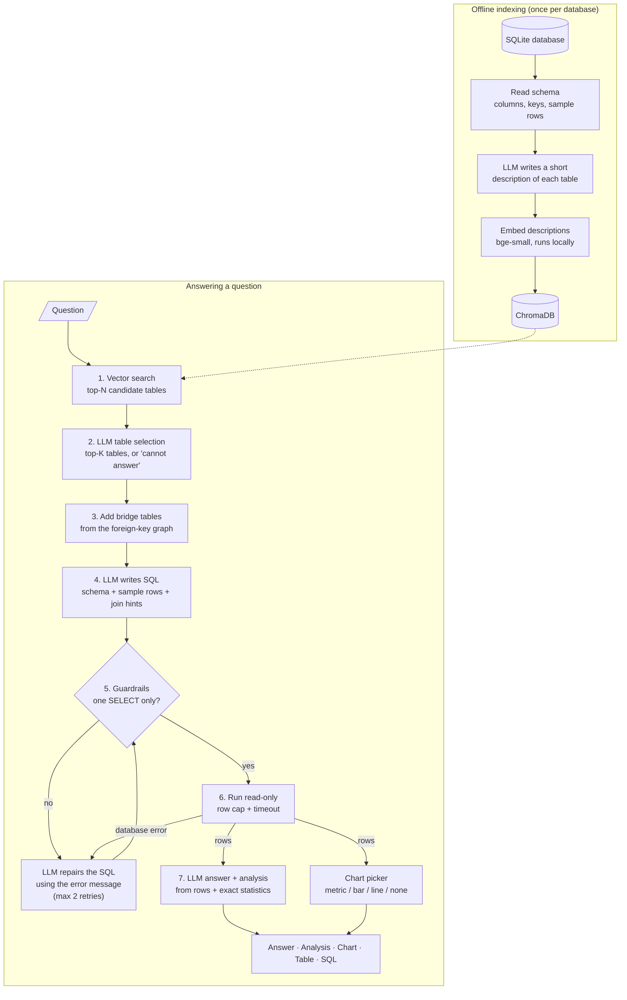

# Text2SQL Analyst

**Ask a database questions in plain English and get answers, not just queries.**

Text2SQL Analyst finds the tables relevant to your question, writes SQL, runs it
safely (read-only), and replies with a short answer, a brief analysis and a chart when
one helps. The generated SQL is always available one click away, so you can check the
work.

It is a small, readable implementation of a retrieval-augmented Text-to-SQL pipeline,
built entirely on free and open-source pieces: open-weight LLMs (served for free by
Groq, or locally with Ollama), a local embedding model, ChromaDB and SQLite.

<!-- EXAMPLE -->

---

## Contents

- [How it works](#how-it-works)
- [Setup](#setup)
- [Usage](#usage)
- [Use your own database](#use-your-own-database)
- [Models and providers](#models-and-providers)
- [Evaluation](#evaluation)
- [Safety](#safety)
- [Project structure](#project-structure)
- [Limitations and future work](#limitations-and-future-work)
- [Credits and references](#credits-and-references)

---

## How it works

The design follows the three stages of the Text-to-SQL pipeline described in the
[NL2SQL Handbook](https://github.com/hkustdial/nl2sql_handbook): **pre-processing**
(schema linking), **translation** (SQL generation) and **post-processing** (correction),
plus an explanation step on top.



### Offline: building the index

1. **Read the schema** ([`db/schema.py`](src/text2sql/db/schema.py)). For every table
   we collect columns, types, primary and foreign keys, the row count and three sample
   rows.
2. **Describe each table** ([`indexing/describe.py`](src/text2sql/indexing/describe.py)).
   An LLM writes two or three sentences per table, such as "each row of `InvoiceLine` is
   one purchased track... useful for sales and revenue questions". Column names alone
   match questions poorly, and descriptions bridge that vocabulary gap. They are saved to
   `data/index/<db>/table_docs.json`, which you can read and edit by hand.
3. **Embed and store** ([`indexing/indexer.py`](src/text2sql/indexing/indexer.py)). The
   descriptions are embedded with `BAAI/bge-small-en-v1.5`, which runs locally on the CPU
   through ONNX, and stored in a persistent ChromaDB collection.

### Online: answering a question

1. **Vector search** ([`retrieval/retriever.py`](src/text2sql/retrieval/retriever.py)).
   The question is embedded and the top-N (default 6) most similar tables are
   retrieved. This step favors recall.
2. **LLM table selection** ([`retrieval/selector.py`](src/text2sql/retrieval/selector.py)).
   A fast model reads the candidates' descriptions and columns and keeps only the
   tables it needs (at most K, default 4). This step favors precision. It can also
   decide that the question **cannot be answered** from this data ("What is the weather
   tomorrow?"), and the pipeline then says so instead of guessing.
3. **Join-path expansion** ([`retrieval/joins.py`](src/text2sql/retrieval/joins.py)).
   "Revenue per genre" needs `Genre` and `InvoiceLine`, but they only connect through
   `Track`, which the question never mentions. A shortest-path search over the
   foreign-key graph adds such bridge tables deterministically.
4. **SQL generation** ([`generation/`](src/text2sql/generation/sql_generator.py),
   [`prompts.py`](src/text2sql/prompts.py)). The prompt contains the question, the
   selected tables as `CREATE TABLE` statements, a few sample rows (so the model sees
   value formats such as `'2010-01-15 00:00:00'`), the exact join conditions, and the
   SQL dialect. The model may also answer `CANNOT_ANSWER: <reason>`.
5. **Guardrails** ([`execution/guardrails.py`](src/text2sql/execution/guardrails.py)).
   `sqlglot` parses the query, which must be exactly one `SELECT`/`WITH` statement with
   no writes, `PRAGMA`, `ATTACH` or dangerous functions. See [Safety](#safety).
6. **Read-only execution with self-correction**
   ([`execution/executor.py`](src/text2sql/execution/executor.py),
   [`pipeline.py`](src/text2sql/pipeline.py)). The query runs on a read-only
   connection with a row cap and a timeout. If it is rejected or fails, the error
   message goes back to the model to fix its own query, up to two times.
7. **Answer and analysis** ([`analysis/answer.py`](src/text2sql/analysis/answer.py)).
   The model gets the question, the SQL, the rows, and **summary statistics computed by
   the application** (totals, averages, extremes, and the share of the top item). LLMs
   are weak at arithmetic over many rows, so the model is asked to explain these exact
   numbers rather than compute them. It returns a direct answer, up to three insights
   and any caveats.
8. **Chart** ([`analysis/charts.py`](src/text2sql/analysis/charts.py)). A conservative
   rule picks the visual. A single number becomes a metric tile. A time column plus a
   number becomes a line chart. A category column plus a number (2–25 rows) becomes a
   sorted bar chart. Anything else gets no chart, because a misleading chart is worse
   than none.

Each stage is a small module with a typed result, and the Streamlit app, the CLI and
the evaluation all call the same `Pipeline.ask()`.

---

## Setup

You need **Python 3.11+** and **git**. The steps below take about 5 minutes. The only
downloads are Python packages, the 1 MB sample database and a 130 MB embedding model;
no large LLM weights.

### 1. Clone and install

```bash
git clone https://github.com/VinayakMokashi/text2sql-analyst.git
cd text2sql-analyst

python -m venv .venv
# Windows (PowerShell):   .venv\Scripts\Activate.ps1
# macOS / Linux:          source .venv/bin/activate

pip install -e ".[dev]"        # or: pip install -r requirements.txt && pip install -e .
```

### 2. Get a free LLM API key (Groq)

1. Sign up at [console.groq.com](https://console.groq.com) (free, no credit card).
2. Create a key under **API Keys**.
3. Copy the example config and paste your key:

```bash
cp .env.example .env           # Windows: copy .env.example .env
# then edit .env and set:  GROQ_API_KEY=gsk_...
```

`.env` is in `.gitignore`, so your key is never committed. If you would rather run
everything locally, see [Run fully offline with Ollama](#run-fully-offline-with-ollama).

### 3. Download the sample database

```bash
python scripts/download_chinook.py
```

This saves [Chinook](https://github.com/lerocha/chinook-database) to
`data/chinook.db`. Chinook is a digital music store with 11 tables: artists, albums,
tracks, genres, playlists, customers, employees, invoices and invoice lines.

### 4. Build the index

```bash
python -m text2sql index
```

This makes one short LLM call per table (11 calls for Chinook) to write the
descriptions, then embeds them locally. The first run also downloads the embedding
model. Use `--no-llm` to build the index with template descriptions and no API key.

### 5. Run it

```bash
streamlit run app/streamlit_app.py      # web UI at http://localhost:8501
python -m text2sql ask "Which 5 genres generate the most revenue?"
```

A `Makefile` wraps these steps (`make install data index app test eval`). On Windows
without `make`, run the commands shown in it.

---

## Usage

### Streamlit app

```bash
streamlit run app/streamlit_app.py
```

Type a question or click an example in the sidebar. Each answer shows:

1. **The answer** in one or two sentences, with the key numbers
2. **Analysis**: up to three observations (comparisons, concentration, trends) and caveats
3. **A chart**, when the shape of the result suits one
4. **The result table**
5. **SQL and how it was produced** (collapsed): the query, any self-correction steps,
   the candidate tables with similarity scores, the tables the LLM selected, bridge
   tables added for joins, and timings per stage

### CLI

```bash
python -m text2sql ask "Who are the top 5 customers by total spending?"
python -m text2sql ask "How did revenue change year over year?" --no-sql
python -m text2sql tables            # list tables and their generated descriptions
python -m text2sql index --refresh   # regenerate the table descriptions
```

Every command accepts `--db`, `--provider`, `--sql-model` and `--helper-model` to
override `.env` for a single run.

### Example questions to try

| Question | What it exercises |
|---|---|
| Which 5 genres generate the most revenue? | 3-table join through a bridge table, ranking, bar chart |
| How did total sales change from year to year? | date functions, line chart |
| Which sales support agent is responsible for the most revenue? | employee → customer → invoice joins |
| What percentage of revenue comes from the USA? | conditional aggregation, metric tile |
| How many tracks have never been purchased? | anti-join / `NOT IN` subquery |
| Which employee has the most people reporting to them? | self-join |
| What is the salary of each employee? | the data has no salaries, so it declines instead of guessing |

---

## Use your own database

Any SQLite file works:

```bash
# in .env
T2S_DB_PATH=path/to/your.db
```

```bash
python -m text2sql index        # builds data/index/<your db name>/
streamlit run app/streamlit_app.py
```

Each database gets its own index folder, so you can switch back and forth. To get
better results:

- **Declare foreign keys** in the schema. The join hints and the bridge-table search
  both rely on them.
- **Review the descriptions** in `data/index/<db>/table_docs.json`. Add business terms
  your users will say ("churn", "ARR", "SKU"), then run `python -m text2sql index` again.
  Existing descriptions are reused, so your edits are kept and no LLM calls are made.
- **Tune the knobs** for larger schemas: `T2S_TOP_N_TABLES` (vector candidates) and
  `T2S_TOP_K_TABLES` (tables kept after selection).
- The prompt, guardrails and executor are written for **SQLite**. Supporting another
  engine means a new connection/executor, and `T2S_SQL_DIALECT` for the prompt and the
  `sqlglot` checks (see [Limitations](#limitations-and-future-work)).

---

## Models and providers

The LLM layer is one small interface ([`llm/base.py`](src/text2sql/llm/base.py)).
Groq, Cerebras, OpenRouter, Ollama, vLLM and LM Studio all speak the same
OpenAI-compatible API, so a single client class covers them all, and switching
providers only means editing `.env`.

The pipeline uses **two model roles**:

| Role | Used for | Default (Groq) | Why |
|---|---|---|---|
| **SQL model** (`T2S_SQL_MODEL`) | SQL generation and repair | `llama-3.3-70b-versatile` | Accuracy matters most here; a 70B open model is strong at SQL |
| **Helper model** (`T2S_HELPER_MODEL`) | table descriptions, table selection, analysis | `llama-3.1-8b-instant` | Easier tasks; a small model is fast and has much higher free-tier limits |

Why a hosted default rather than a local one? Running a 7B model on a typical laptop
CPU takes 15–40 s per question and needs a 4–5 GB download. Groq serves the same
open-weight models for free in about 1–3 s, which suits a demo. Everything still works
fully offline with Ollama if you prefer.

### Provider presets

| `T2S_LLM_PROVIDER` | Key variable | Notes |
|---|---|---|
| `groq` (default) | `GROQ_API_KEY` | Free tier, very fast. Llama 3.x, Qwen3, gpt-oss and other open models |
| `cerebras` | `CEREBRAS_API_KEY` | Free tier, very fast |
| `openrouter` | `OPENROUTER_API_KEY` | `:free` models (e.g. Qwen2.5-Coder-32B) have low daily limits |
| `ollama` | none | Local; see below |
| `openai_compatible` | `T2S_LLM_API_KEY` | Any OpenAI-style endpoint via `T2S_LLM_BASE_URL` (vLLM, LM Studio, ...) |
| `fake` | none | Deterministic replies; used by the tests |

Free-tier limits change over time; check your provider's console. On Groq, the
per-day token limit of the 70B model (roughly 100k tokens/day at the time of writing)
is enough for about 50–70 questions. If you hit it, switch `T2S_SQL_MODEL` to a model
with a larger quota, such as `qwen/qwen3-32b` or `llama-3.1-8b-instant`.

### Run fully offline with Ollama

```bash
# install from https://ollama.com/download, then:
ollama pull qwen2.5-coder:7b
```

```bash
# .env
T2S_LLM_PROVIDER=ollama
T2S_SQL_MODEL=qwen2.5-coder:7b
T2S_HELPER_MODEL=qwen2.5-coder:7b     # one model in memory keeps RAM usage low
```

Rough hardware guide for local models (4-bit quantized, the Ollama default):

| Model size | Example | Download | RAM needed | Speed on a laptop CPU |
|---|---|---|---|---|
| 1.5–3B | `qwen2.5-coder:3b`, `llama3.2:3b` | 1–2 GB | 4–8 GB | fast, but noticeably less accurate |
| 7–8B | `qwen2.5-coder:7b`, `llama3.1:8b` | 4.5–5 GB | 8–16 GB | 15–40 s per question |
| 14B | `qwen2.5-coder:14b` | 9 GB | 16–32 GB | slow without a GPU |
| 32B+ | `qwen2.5-coder:32b` | 20 GB | 32 GB+ or a GPU with 24 GB | GPU recommended |

SQL-specialized open models such as SQLCoder (`sqlcoder:7b` on Ollama) or OmniSQL (on
Hugging Face) plug in the same way. Note that SQLCoder expects its own prompt format
and does better with prompt tuning.

---

## Evaluation

[`eval/questions.jsonl`](eval/questions.jsonl) contains **47 hand-written questions**
about Chinook, each with gold SQL: 14 easy (one table), 15 medium (one join or
grouping), 14 hard (multi-hop joins, subqueries, self-joins, conditional aggregation),
and 4 **unanswerable** questions such as salaries or ratings, which the system should
decline. Every gold query was run and checked for a single correct answer (for example,
no ties at a "top 5" cut-off).

**Metrics**

- **Execution accuracy (EX)**: the predicted query returns the same data as the gold
  query. It is slightly lenient in the ways a human grader would accept: extra columns
  are fine, row and column order are ignored, numbers are compared at 2 decimal places,
  and some questions accept both `FirstName, LastName` and a concatenated full name. Row
  counts must match exactly. See [`evaluation.py`](src/text2sql/evaluation.py).
- **Declined unanswerable / false refusals**: unanswerable questions correctly declined,
  and answerable questions wrongly declined.
- **Table recall@N**: share of the gold query's tables among the vector-search
  candidates. **Final schema recall**: the same, after LLM selection and join expansion,
  meaning the tables the SQL model actually saw.
- **Latency**: wall-clock time per question for retrieval, selection, generation,
  execution and repairs; the analysis step is skipped because it does not affect EX.

### Results

<!-- EVAL_RESULTS -->

### Rerun it

```bash
python eval/run_eval.py                                              # model from .env
python eval/run_eval.py --models llama-3.3-70b-versatile qwen/qwen3-32b llama-3.1-8b-instant
python eval/run_eval.py --ids h01 h02 --sleep 0                      # a few questions
```

The script writes a per-question log (`eval/results/<model>.jsonl`) with every SQL
query and failure reason, plus `summary.md` and `summary.json`. The helper model stays
fixed, so differences come from the SQL model alone.

---

## Safety

The query runs against the database only after three independent layers:

1. **Static checks with `sqlglot`**: exactly one statement; the root must be a `SELECT`,
   a set operation or a subquery; and no node anywhere in the tree may write, alter,
   `ATTACH`, `PRAGMA` or `SET`. For example, a data-modifying CTE
   (`WITH d AS (DELETE ... RETURNING *) SELECT ...`) is caught. Functions that touch the
   file system or load native code (`load_extension`, `readfile`, ...) are rejected.
2. **A read-only connection**: the database is opened with SQLite's `mode=ro` URI and
   `PRAGMA query_only=ON`. Even if a query slipped past the parser, SQLite itself would
   refuse to write.
3. **Resource limits**: at most `T2S_MAX_ROWS` rows are fetched (default 200; the SQL
   is not rewritten), and a progress handler aborts any query that runs longer than
   `T2S_QUERY_TIMEOUT_S` (default 10 s).

Rejected queries return a readable error. The pipeline feeds that error back to the
model once or twice to fix, and then stops.

Also: API keys live only in `.env`, which is git-ignored. Result rows are sent to the LLM
provider for the analysis step, so use a local model (Ollama) for data that must not
leave your machine.

---

## Project structure

```
text2sql-analyst/
├── src/text2sql/
│   ├── config.py            # all settings, read from .env (T2S_* variables)
│   ├── prompts.py           # every prompt in one place
│   ├── pipeline.py          # Pipeline.ask(): the stages wired together
│   ├── cli.py               # python -m text2sql {index,ask,tables}
│   ├── evaluation.py        # execution-accuracy matching, table recall
│   ├── llm/                 # provider interface: OpenAI-compatible client, fake LLM, factory
│   ├── db/                  # read-only connection, schema introspection
│   ├── indexing/            # table descriptions, local embeddings, Chroma index
│   ├── retrieval/           # vector search, LLM table selection, join-path expansion
│   ├── generation/          # SQL generation, extraction and repair
│   ├── execution/           # sqlglot guardrails, read-only executor
│   └── analysis/            # answer + analysis, column roles, chart picker
├── app/streamlit_app.py     # web UI
├── scripts/download_chinook.py
├── eval/                    # questions.jsonl, run_eval.py, results/
└── tests/                   # pytest suite, runs offline (fake LLM + hashing embedder)
```

### Tests

```bash
pytest          # about 90 tests, a few seconds, no network or API key needed
ruff check .
```

The tests use a tiny in-memory shop database, a scripted `FakeLLM` and a
bag-of-words hashing embedder, so they are fast and deterministic. They cover the
guardrails (including attempted writes, multi-statement injection, `ATTACH`/`PRAGMA`,
data-modifying CTEs and timeouts), retrieval and selection, prompt building, the
self-correction loop, abstention, the chart rules and the evaluation metric.

---

## Limitations and future work

**Limitations**

- **Small demo schema.** Chinook has 11 tables, so retrieval is easy. Table retrieval
  matters much more with hundreds of tables, where you would raise `T2S_TOP_N_TABLES`
  and write better descriptions.
- **SQLite only.** The dialect is a setting, but the executor and timeout mechanism are
  SQLite-specific.
- **No value linking.** If a user misspells a value ("ACDC" for "AC/DC"), the model
  has only the sample rows to go on. It does not search actual column values.
- **One question at a time.** There is no conversation memory, so follow-ups like "and
  for 2012?" are not resolved.
- **The analysis can still be wrong.** It is grounded in the rows and in exact
  statistics, but it is generated text. The SQL and table are shown so you can verify.
- **A small, self-written eval set.** 47 questions are enough to compare models, not to
  claim benchmark numbers. The questions were written by the same person who built the
  system, which risks optimistic bias.
- **Free-tier limits.** Hosted free tiers cap requests and tokens per day.

**Possible improvements**

- Retrieve **few-shot examples** (similar question → SQL pairs) into the prompt
- **Value retrieval**: index distinct column values to fix misspelled filters
- **Self-consistency**: generate several queries and keep the answer most of them agree on
- **Conversation memory** for follow-up questions
- PostgreSQL / DuckDB executors
- Evaluate on a public benchmark subset (Spider 2.0-lite, BIRD mini-dev)
- Caching of repeated questions and a query history view

---

## Credits and references

- **NL2SQL Handbook**, HKUST(GZ) DIAL: <https://github.com/hkustdial/nl2sql_handbook>, and
  the survey behind it: X. Liu, S. Shen, B. Li, P. Ma, R. Jiang, Y. Zhang, J. Fan, G. Li,
  N. Tang, Y. Luo. *A Survey of Text-to-SQL in the Era of LLMs: Where are we, and where
  are we going?* IEEE TKDE, 2025. The pipeline stages and evaluation approach here
  follow its taxonomy.
- **Chinook database** by Luis Rocha: <https://github.com/lerocha/chinook-database>
  (MIT License)
- **Models** (open weights, each under its own license):
  - Meta Llama 3.3 70B Instruct and Llama 3.1 8B Instruct (Llama 3.3 / 3.1 Community
    License)
  - Qwen3 (Apache 2.0) and Qwen2.5-Coder (Apache 2.0) from Alibaba Qwen
  - `BAAI/bge-small-en-v1.5` embeddings (MIT)
- **Libraries**: [sqlglot](https://github.com/tobymao/sqlglot) (MIT),
  [ChromaDB](https://github.com/chroma-core/chroma) (Apache 2.0),
  [FastEmbed](https://github.com/qdrant/fastembed) (Apache 2.0),
  [Streamlit](https://streamlit.io) (Apache 2.0),
  [OpenAI Python SDK](https://github.com/openai/openai-python) (Apache 2.0), used only as
  a client for OpenAI-compatible endpoints,
  [pandas](https://pandas.pydata.org), [Rich](https://github.com/Textualize/rich)
- **Hosting of open models**: [Groq](https://groq.com), [Ollama](https://ollama.com)

## License

[MIT](LICENSE)
